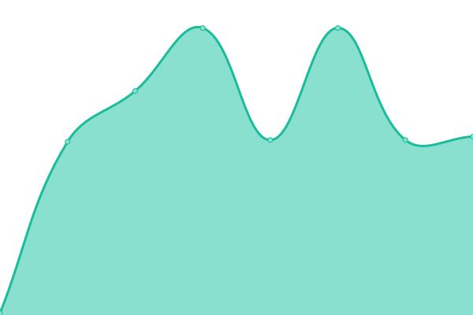

# [📈 Live Status](https://status.cihar.com): <!--live status--> **🟩 All systems operational**

This repository contains the open-source uptime monitor and status page for [Michal Čihař](https://blog.cihar.com/), powered by [Upptime](https://github.com/upptime/upptime).

With [Upptime](https://upptime.js.org), you can get your own unlimited and free uptime monitor and status page, powered entirely by a GitHub repository. We use [Issues](https://github.com/nijel/status/issues) as incident reports, [Actions](https://github.com/nijel/status/actions) as uptime monitors, and [Pages](https://status.cihar.com) for the status page.

<!--start: status pages-->
<!-- This summary is generated by Upptime (https://github.com/upptime/upptime) -->
<!-- Do not edit this manually, your changes will be overwritten -->
<!-- prettier-ignore -->
| URL | Status | History | Response Time | Uptime |
| --- | ------ | ------- | ------------- | ------ |
|  [cihar.com](https://cihar.com/) | 🟩 Up | [cihar-com.yml](https://github.com/weblate-status-bot/nijel-status/commits/HEAD/history/cihar-com.yml) | 

 574ms
     
 | 

<a href="https://status.cihar.com/history/cihar-com">100.00%</a>
    

|  [blog.cihar.com](https://blog.cihar.com/) | 🟩 Up | [blog-cihar-com.yml](https://github.com/weblate-status-bot/nijel-status/commits/HEAD/history/blog-cihar-com.yml) | 

 744ms
     
 | 

<a href="https://status.cihar.com/history/blog-cihar-com">100.00%</a>
    

|  [wammu.eu](https://wammu.eu/) | 🟩 Up | [wammu-eu.yml](https://github.com/weblate-status-bot/nijel-status/commits/HEAD/history/wammu-eu.yml) | 

 607ms
     
 | 

<a href="https://status.cihar.com/history/wammu-eu">100.00%</a>
    

|  [bypetula.cz](https://bypetula.cz/) | 🟩 Up | [bypetula-cz.yml](https://github.com/weblate-status-bot/nijel-status/commits/HEAD/history/bypetula-cz.yml) | 

 622ms
     
 | 

<a href="https://status.cihar.com/history/bypetula-cz">100.00%</a>
    

|  [darky.cihar.com](https://darky.cihar.com/) | 🟩 Up | [darky-cihar-com.yml](https://github.com/weblate-status-bot/nijel-status/commits/HEAD/history/darky-cihar-com.yml) | 

 895ms
     
 | 

<a href="https://status.cihar.com/history/darky-cihar-com">100.00%</a>
    

|  [svatba.cihar.com](https://svatba.cihar.com/) | 🟩 Up | [svatba-cihar-com.yml](https://github.com/weblate-status-bot/nijel-status/commits/HEAD/history/svatba-cihar-com.yml) | 

 463ms
     
 | 

<a href="https://status.cihar.com/history/svatba-cihar-com">100.00%</a>
    

|  [webmail.cihar.com](https://webmail.cihar.com/) | 🟩 Up | [webmail-cihar-com.yml](https://github.com/weblate-status-bot/nijel-status/commits/HEAD/history/webmail-cihar-com.yml) | 

 666ms
     
 | 

<a href="https://status.cihar.com/history/webmail-cihar-com">100.00%</a>
    

|  [apartmancvikov.cz](https://apartmancvikov.cz/) | 🟩 Up | [apartmancvikov-cz.yml](https://github.com/weblate-status-bot/nijel-status/commits/HEAD/history/apartmancvikov-cz.yml) | 

 1054ms
     
 | 

<a href="https://status.cihar.com/history/apartmancvikov-cz">100.00%</a>
    

|  [SMTP](mail.cihar.com) | 🟩 Up | [smtp.yml](https://github.com/weblate-status-bot/nijel-status/commits/HEAD/history/smtp.yml) | 

 130ms
     
 | 

<a href="https://status.cihar.com/history/smtp">100.00%</a>
    

|  [IMAP](mail.cihar.com) | 🟩 Up | [imap.yml](https://github.com/weblate-status-bot/nijel-status/commits/HEAD/history/imap.yml) | 

 130ms
     
 | 

<a href="https://status.cihar.com/history/imap">100.00%</a>
    

<!--end: status pages-->

[**Visit our status website →**](https://status.cihar.com)

## 📄 License

- Powered by: [Upptime](https://github.com/upptime/upptime)
- Code: [MIT](./LICENSE) © [Michal Čihař](https://blog.cihar.com/)
- Data in the `./history` directory: [Open Database License](https://opendatacommons.org/licenses/odbl/1-0/)
